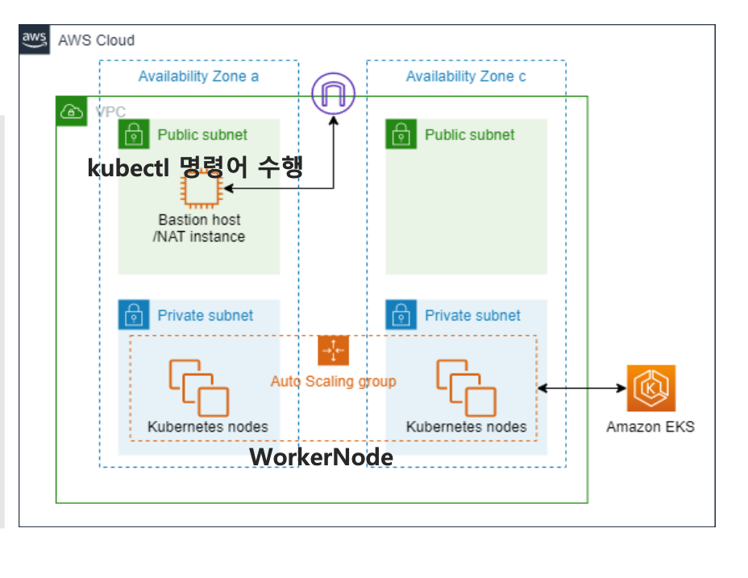

# eks-basic-class
eks-basic-class - EKS를 처음 접하는 분 ( vpc 및 subnet , bastion server을 구축합니다. )
- 2티어로 구성된 AZ zone a , c 존에  public , private 각각 2개의 subnet을 생성해주세요.
- bastion server을 public subnet에 생성해주세요.
- eks 생성은 5장에서 진행 합니다.
  *   

---

###  IP Calculator (cidr 계산기)
```
https://jodies.de/ipcalc
```
---

### [vpc 개념 및 subnet 생성 참고 사이트](https://velog.io/@lijahong/0%EB%B6%80%ED%84%B0-%EC%8B%9C%EC%9E%91%ED%95%98%EB%8A%94-AWS-%EA%B3%B5%EB%B6%80-EKS-%EA%B5%AC%EC%B6%95%ED%95%98%EA%B8%B0-%EA%B8%B0%EB%B3%B8-%ED%99%98%EA%B2%BD-%EA%B5%AC%EC%B6%95) 

---


### 각 용어들 개념 익히기

#### 
- 리전이란?
  * 지리적 관점으로 영역을 구분 
    한국 수도권(ap-northeast-2) , 미국 서부(us-west-2)  

- 가용영역 (Availability Zone - AZ)
  * 리전이 국가/도시 단위의 지리적 위치라면, 가용영역(AZ)는 각 리전(국가/도시) 안의 데이터센터 이다. aws 서버 컴퓨터들이 모여있는 건물이라고 이해하면 된다.  

- Vpc란? - 집
  * 가상의 공간(네트워크)
    그 크기는 뭘로 결정하냐? 바로 cidr값으로 !! cidr은 10.0.0.0/24  뒤에 /24가 cidr 값이다.  
  * [cidr 계산기](https://jodies.de/ipcalc)   
- subnet란? - 방
  * vpc 가상의 공간안에서 방이라고 생각하면 쉽다.  
  * 방 종류는 공개방[public subent]와 비공개방[private subnet] 2종류  
    방의 크기는 뭘로 결정?  
    방의 크기 또한 바로 cidr 값으로 결정 – 편하게 계산기 돌리자!!
  
  * 공개방은 외부에서 들어 올 수 출입문이 있어야하는데 이 출입문은 뭘로 만든다?  
    바로 인터넷게이트웨이 비공개방은 비밀의 방이기 때문에 외부에서 바로 들어올수 없으며  
    공개방을 먼저 들어온 후에 비밀의 방으로 들어갈  수 있다.  
    비밀의 방으로 들어가는 비밀 통로는 NAT 게이트웨이로 생성 가능.
    이로 인해 비밀의 방에서도 NAT 게이트웨이를 통해서 외부로 갈수 있다.  
    ( 이 말은 즉슨 private subnet도 nat gateway를 통해 인터넷이 가능. 자세한 설명은 아래 NAT 참조 )

- NAT gateway - 비공개방에서 공개방으로 나갈수 있는 통로
  * 공개방 에만 설치가 가능하며 비공개방에서 외부로 인터넷으로 요청이 가능하지만 외부에서는 직접 접근은 불가능하다.  
    따라서 내부에서는 외부로 소리를 전달할수 있지만 외부에서의 소리는 내부로 들어갈 수 없다.  
    왜 필요하냐??!! 프라이빗 네트워크 에서 인터넷과 통신할 수 있게 해줄려고~ 필요 !!  

  * NAT gateway 사전적 의미  
   NAT Gateway는 인터넷에서의 통신을 위해 하나 이상의 퍼블릭 IP 주소를 사용하며,  
   이러한 주소를 통해 프라이빗 네트워크의 리소스가 외부와 통신할 수 있습니다.  
   이때, NAT Gateway의 ENI는 해당 게이트웨이와 VPC(가상 사설 클라우드) 간의 통신을 담당하며,  
   이를 통해 프라이빗 서브넷 내의 인스턴스들이 NAT Gateway를 통해 인터넷으로 연결됩니다.  
   따라서 NAT Gateway의 ENI는 인터넷 연결을 가능케 하며, 프라이빗 서브넷 내의 인스턴스들이 외부와 통신할 수 있도록 하는데 필수적입니다.  

  * 비용 비쌈!! 오래 사용 안할시 삭제 , 시간당 0.045 USD - 시간당60원

- Routing Table 이란? - 어느 방으로 소리(패킷) 칠지 대상을 결정하는곳  
  * 라우터가 패킷을 어디로 전송할지 경로를 결정하는 방법은 라우팅 테이블을 참조하여 결정 
  * 어느 방으로 소리(패킷을 전송)칠지 결정하는 곳  
  * 라우팅 테이블 설정 2가지  
    1. 라우팅 편집 - IGW or NAT 맵핑 ( 소리 칠 영역을 추가 한다고 보면 된다! )  
    2. 서브넷 연결 - 원하는 subnet 맵핑 ( 어디에다가 소리칠지 소리 칠 영역 설정 )  
    3. tip - aws 기본 라우팅 테이블은 vpc 내부 통신 로컬 라우팅은 기본 설정 적용 된다.  
  
- Security Group 이란? - 방안에 있는 컴퓨터(서비스)에 보안 설정 
  * 인바운드 ( 해당 서비스에 들어오는 사람 ) 제한걸기
  * 아웃바운드 (  해당 서비스에 나가는 사람 ) 제한걸기

- ENI란 - Elastic Network Interface 약자 
  * ** 가장 중요한 핵심은!! 다른 네트워크 리소스와 통신할 수 있도록 한다!  
    ( 따라서 이게 어디에 적용되어 있냐? 바로 NAT에 설정되어 있다. 상세 설명 아래 참조 )
  * 상세 설명
    * NAT Gateway는 프라이빗 네트워크 내부의 리소스가 인터넷과 통신할 수 있게 하는 서비스입니다.  
      이때 NAT Gateway의 역할 중 하나는 네트워크 주소 변환입니다.
    * NAT Gateway는 인터넷에서의 통신을 위해 하나 이상의 퍼블릭 IP 주소를 사용하며,  
      이러한 주소를 통해 프라이빗 네트워크의 리소스가 외부와 통신할 수 있습니다.  
      이때, NAT Gateway의 ENI는 해당 게이트웨이와 VPC(가상 사설 클라우드) 간의 통신을 담당하며,  
      이를 통해 프라이빗 서브넷 내의 인스턴스들이 NAT Gateway를 통해 인터넷으로 연결됩니다.
    * 따라서 NAT Gateway의 ENI는 인터넷 연결을 가능케 하며,   
      프라이빗 서브넷 내의 인스턴스들이 외부와 통신할 수 있도록 하는데 필수적입니다.
- NACL (Network Access Control Lists) 이란?
   * 방 그룹을 생성 하고( 따라서 방을 선택 해야함 ) 각 방마다(subnet) 들어가고 나가는 규칙을 설정.  
      기술적 정의 : ACL은 라우팅 테이블을 지나 서브넷으로 들어가고 나가는(inbound & outbound) 트래픽을 제어한다
   * 사전 정의  
   AWS 공식 문서에서는 네트워크 ACL을 "네트워크 ACL(액세스 제어 목록)은 1개 이상의 서브넷 내부와  
  외부의 트래픽을 제어하기 위한 방화벽 역할을 하는 VPC를 위한 선택적 보안 계층" 이라고 정의하고 있습니다.
  
- Tip!!
  *   보안그룹과 네트워크 ACL 비교 [아래표 참조]
  *  |보안그룹| 네트워크 ACL|
     |:---:|:---:|  
      |인스턴스 단에서 실행	| 서브넷 단에서 실행|
      |허용(allow) 규칙만 지원 |	허용(allow) 및 거부(deny) 규칙 지원|
      |스테이트풀(stateful): 어떤 규칙과도 관계없이, 반환 트래픽이 자동적으로 허용된다.	|스테이트레스(stateless): 반환 트래픽이 특정 규칙에 의해서 허용된다.|
      |트래픽을 허용할 것인가에 대한 결정 전 모든 규칙을 평가한다.	| 트래픽을 허용할 것인가에 대해 결정할 때 가장 낮은 번호의 규칙부터 시작하여 순서대로 규칙들을 수행한다.|
      |인스턴스를 시작할 때 보안그룹을 명시하거나 나중에 인스턴스와 보안그룹을 연결할 때에만 인스턴스에 적용된다.|	연결된 서브넷 내 모든 인스턴스에 자동적으로 적용된다.  
      | - | 보안그룹이 너무 관대할 경우, 추가적인 방화벽을 제공한다.|
