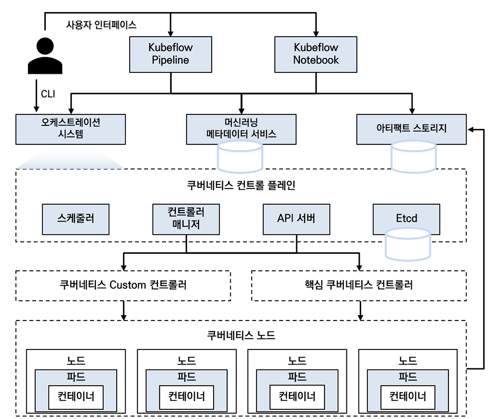
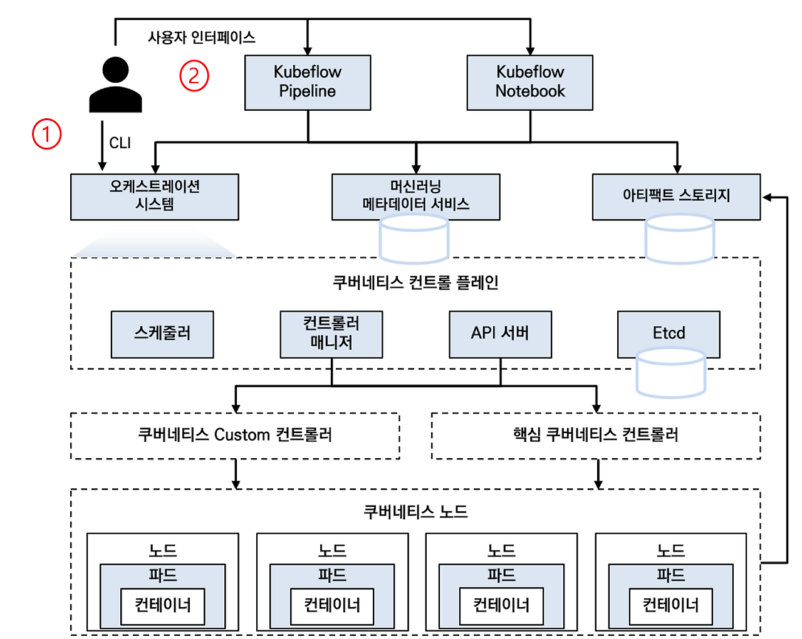
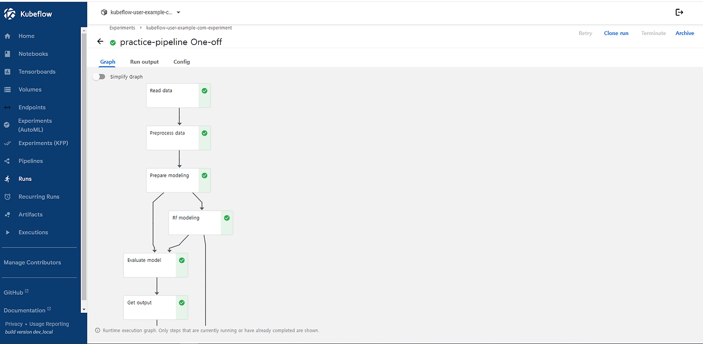
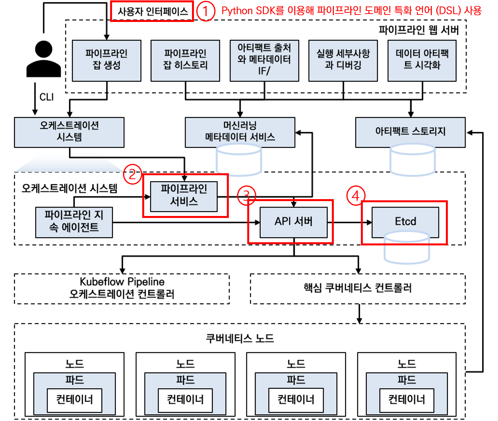
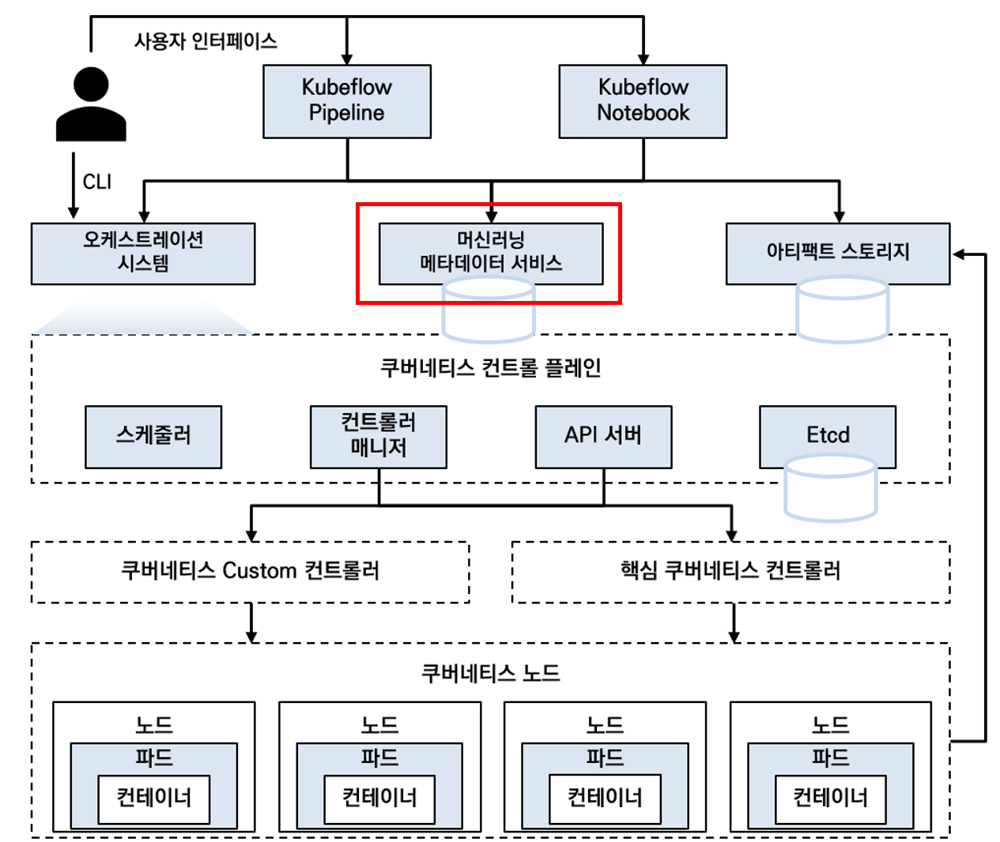

# kubeflow 아키텍처
# 쿠베플로 전체 아키텍처
  

- 위 다이어그램은 쿠브플로의 상위 단계 아키텍처를 나타낸다.

- 쿠브플로 시스템의 시작은 1. CLI를 통한 요청 / 2. kubectl을 통한 요청으로 나뉘며

- 이러한 요청을 통해 쿠버플로 잡(Job) 이 생성된다.

- 쿠브플로 잡은 주피터 노트북과 같은 Kubeflow Notebook일 수 있으며

- 파이프라인(Kubeflow Pipeline)으로 연결된 파이썬 스크립트일 수 있다  

---  
  

# 쿠베플로우 잡 실행방식

1. CLI
명령 줄 인터페이스에서 파이썬 스크립트 수행 목적으로 kubectl을 사용해 쿠브 플로 잡을 실행할 수 있다.

 

2. 사용자 인터페이스  
파이프라인을 활용한 사용자 인터페이스에서 직접 비순환 그래프를 구성하고,  
이것을 이용해 쿠브플로에서 오케스트레이션(관리)되는 여러 개를 관리할 수 있다.

- 

--- 

# 파이프라인아키텍처 아키텍처 ( 파이프라인 도메인 특화언어 DSL의 이해)
  
- 1. 쿠브플로 파이프라인의 고수준 실행은 정적 설정에서 정적 파이프라인을 생성하기 위해 파이프라인 서비스를 호출한다.  
      여기서 파이프라인 설정을 위해 Python SDK를 이용해 파이프라인 도메인 특화언어(DSL)을 써야 하며,  
    이 DSL 컴파일러는 파이프라인 설정을 YAML 파일(정적 설정)으로 바꿔준다.

 

- 2. 파이프라인 서비스가 파이프라인 실행에 필요한 쿠버네티스 리소스(CRD)을 준비하고 실행하기 위해 쿠버네티스 API 서버를 호출한다.

 

- 3. API 서버가 오케스트레이션 컨트롤러와 쿠버네티스 컨트롤러를 통해 파이프라인 잡을 실행하며

 

- 4. 쿠버네티스 자체 기반 데이터는 etcd 에 저장이 되며, 쿠브플로와 관련된 머신러닝 메타데이터와 아티팩트는 각각 데이터베이스와 오브젝트 스토리지에 저장된다.

---

# 메타데이터 아키텍처
  

쿠버플로 잡이 실행되며 쌓이는 메타데이터는 쿠버플로 MySQL 데이터베이스에 쌓이게 된다.
이렇게 저장된 메타데이터는 특정 실험에서 실행되는 잡을 추적하도록 도와준다.
여기서 메타데이터는 아래와 같은 것들을 의미한다.

- 실행에 대한 메타데이터

- 머신러닝 모델에 대한 데이터

- 데이터셋에 대한 데이터

---

