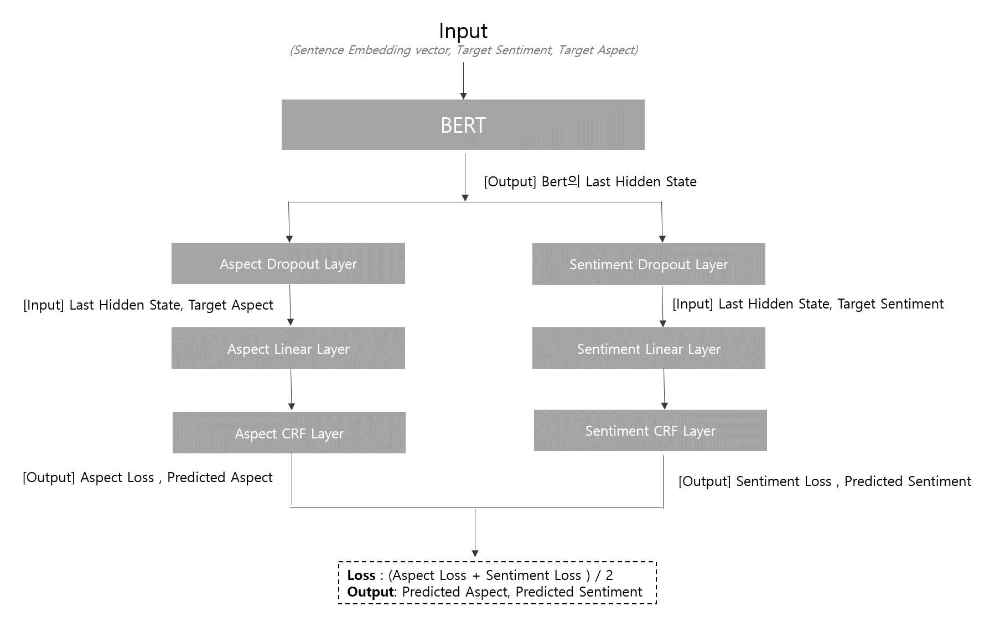

##  Model Description
***

# Aspect-Based Sentiment Analysis 모델 설명

## **1. 입력**
입력은 다음과 같은 요소로 구성됩니다:
- **문장 임베딩 벡터**: 입력 문장을 임베딩하여 의미를 수치적으로 표현한 벡터.
- **목표 감정(Target Sentiment)**: 문장에서 추출하려는 감정 정보 (예: 긍정, 부정, 중립).
- **목표 측면(Target Aspect)**: 문장에서 감정과 연관된 특정 측면 (예: "서비스", "음식").

이 입력은 **BERT** 모델에 전달됩니다.

---

## **2. BERT**
**BERT (Bidirectional Encoder Representations from Transformers)**는 입력을 처리하고 다음을 출력합니다:
- **마지막 히든 상태(Last Hidden State)**: 문장의 맥락 정보를 포함하는 벡터 표현.

출력: `[Output] BERT의 Last Hidden State`

---

## **3. 두 개의 병렬 처리 분기**
BERT 출력은 두 개의 병렬 경로로 나뉩니다:

### **(1) 측면 추출 경로 (Aspect Extraction Path)**
- **Aspect Dropout Layer**: 학습 과정에서 과적합(overfitting)을 방지하기 위해 일부 뉴런을 랜덤하게 제거.
- **Aspect Linear Layer**: 선형 변환을 통해 측면 예측에 필요한 특징을 추출.
- **Aspect CRF Layer**: CRF(Conditional Random Field)는 연속 데이터(문장)에서 태깅 작업의 정확성을 향상.

출력: **Aspect Loss**, **Predicted Aspect**

### **(2) 감정 분석 경로 (Sentiment Analysis Path)**
- **Sentiment Dropout Layer**: 과적합을 방지.
- **Sentiment Linear Layer**: 선형 변환을 통해 감정 분석에 필요한 특징을 추출.
- **Sentiment CRF Layer**: CRF는 감정 태깅 작업의 정확성을 향상.

출력: **Sentiment Loss**, **Predicted Sentiment**

---

## **4. 손실 함수(Loss) 및 최종 출력**
- **손실 계산**: 모델은 두 개의 손실 함수를 사용합니다.
  - **Aspect Loss**: 측면 예측에서의 오차.
  - **Sentiment Loss**: 감정 예측에서의 오차.
  - **최종 손실**: 두 손실의 평균 값: `Loss = (Aspect Loss + Sentiment Loss) / 2`.

- **출력**:
  - **Predicted Aspect**: 예측된 문장의 측면.
  - **Predicted Sentiment**: 예측된 측면에 대한 감정.

---

## **모델 사용 사례**
이 모델은 **Aspect-Based Sentiment Analysis (ABSA)** 작업에 사용되며 다음과 같은 작업에 유용합니다:
- 특정 제품 리뷰에서 "화면", "배터리" 등 특정 측면과 해당 감정을 동시에 추출.
- 리뷰에 대한 세부적인 감정 분석 수행.

### 예시:
- **입력 문장**: "이 레스토랑의 서비스는 훌륭하지만 음식은 별로였어요."
- **예측된 측면(Predicted Aspect)**: "서비스", "음식"
- **예측된 감정(Predicted Sentiment)**: "긍정(서비스)", "부정(음식)"
