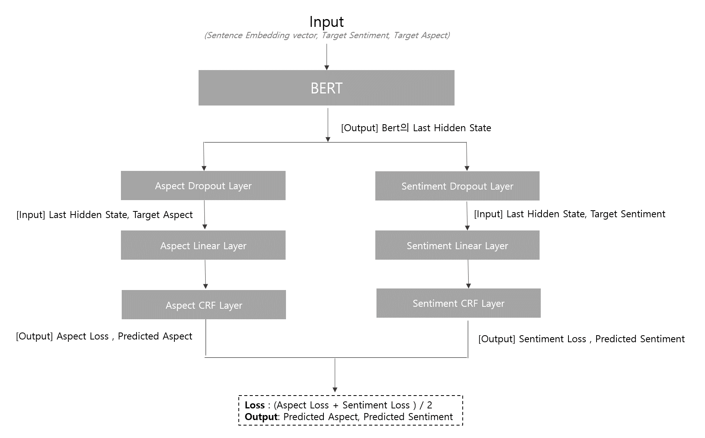
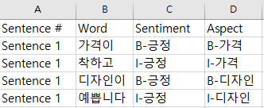
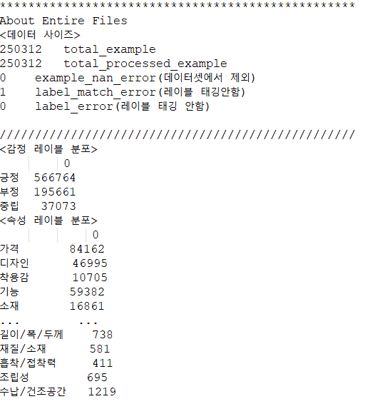
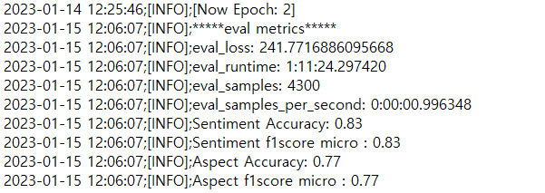
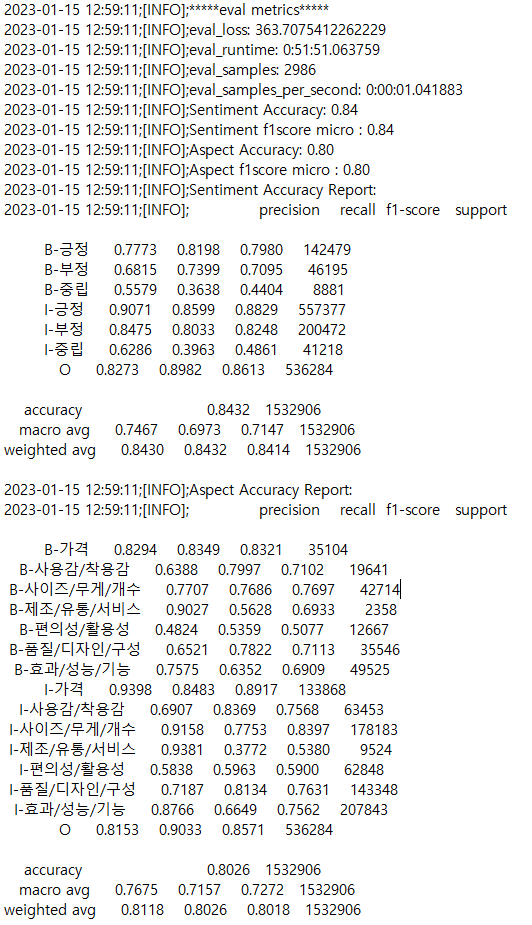

속성기반 감정분석(Aspect Based Sentiment Analysis)
====================================
__NIA 데이터 구축과제(ABSA)__ 의 데이터 품질 검사용으로 구현된 소스

- __목적__ 
    - 구축된 데이터셋이 유효한 데이터셋인지 검증하기 위함 (데이터 품질 검사)
        - 사전 품질 검증 전 측정 지표 적정성 및 정량 목표 달성도 점검 목적
        - 데이터 구축 실행 단계에서의 오류 유형에 따른 보완 조치 방안 마련 및 반영 여부 확인
- __목표__
  - 성능의 정량적 목표
    - Sentiment f1score : 80% 이상 달성
    - Asepct Category f1score : 80% 이상 달성
  - 목표 구축 데이터 수: 25만건

    
## Model Description
***

- Sentiment와 대분류 Aspect Category 예측에 동일한 BERT(klue-bert)를 사용
- Dropout Layer와 Linear Layer, CRF layer는 각기 다른 layer를 사용
- loss function은 NLL(Negative Log Likelihood) Loss
- 최종 loss를 대분류 Aspect Category loss와 Sentiment Loss의 평균으로 계산하는 joint training 방식의 학습 구조


## ABOUT DATA
***
### 원본 데이터 (json)
```shell
[
  {
    "Index": "7",
    "RawText": "가격이 착하고 디자인이 예쁩니다",
    "Source": "쇼핑몰",
    "Domain": "패션",
    "MainCategory": "여성의류",
    "ProductName": "OO 플** 베스트 풀코디 3종",
    "ReviewScore": "100",
    "Syllable": "17",
    "Word": "4",
    "RDate": "20210815",
    "GeneralPolarity": "1",
    "Aspects": [
      {
        "Aspect": "가격",
        "SentimentText": "가격이 착하고",
        "SentimentWord": "2",
        "SentimentPolarity": "1"
      },
      {
        "Aspect": "디자인",
        "SentimentText": "디자인이 예쁩니다",
        "SentimentWord": "2",
        "SentimentPolarity": "1"
      }
    ]
  }
]
```
### 학습 데이터 (csv)



개발 환경 설정
----------------------
```shell
!pip install -r ./requirements.txt
```

## 1. 학습 데이터 파싱 (json to csv)
***
### 1-1. 실행 방법
#### Windows
```shell
./scripts/data/data_parsing.sh
```
#### Linux
```shell
sh ./scripts/data/data_parsing.sh
```

### 1-2. Parameter info
| 파라미터 | 설명  |
|------|-----|
| fp   | 학습 데이터 형태로 파싱할 json 데이터의 경로 혹은 파일명 |
| save_p | 파싱된 학습 데이터를 저장할 경로 (해당 경로가 존재하지 않을 시, 자동 생성) |
| encoding | 파싱 후 데이터를 저장할 때, 어떤 인코딩 형식으로 저장할지 설정 (default: utf-8-sig) |
| val_ratio | 원본 데이터에서 분할을 수행할 검증 데이터의 비율 (default: 0.1) |
| test_ratio | 원본 데이터에서 분할을 수행할 평가 데이터의 비율 (default: 0.1) |


## 2. 데이터 형태소 분석
***
### 2-1. 실행 방법
#### Windows
```shell
./scripts/data/pos_analysis.sh
```
#### Linux
```shell
sh ./scripts/data/pos_analysis.sh
```

### 2-2. Parameter info
| 파라미터  | 설명 |
|-------|-----------------------------------------------------------|
| fp   | 형태소 분석을 수행할 데이터의 경로 혹은 파일명 (단, 모델 학습용으로 파싱된 csv 형식의 데이터일 것) |
| encoding | 형태소 분석을 수행할 데이터의 인코딩 형식 (default: utf-8-sig)              |
| log_fp | 형태소 분석 로그를 저장할 경로, 존재하지 않을 시 생성됨 (default: './logs')      |
| log_filename | 저장될 로그의 파일 명 (default: 실행시점 + _pos_analysis.log)          |


  
## 3. 학습 (Training)
***
### 3-1. 실행 방법
#### Windows
```shell
./scripts/model/do_train.sh
```
#### Linux
```shell
sh ./scripts/model/do_train.sh
```

### 3-2. Parameter info
| 파라미터                 | 설명                                                                     |
|----------------------|------------------------------------------------------------------------|
| train_fp             | 학습 데이터들이 포함된 디렉토리 경로 or 학습 데이터 파일 경로 설정                                |
| valid_fp             | 검증 데이터들이 포함된 디렉토리 경로 or 검증 데이터 파일 경로 설정                                |
| epochs               | 데이터셋을 학습할 횟수 (default: 10)                                             |
| train_batch_size     | 한 batch에 속할 학습 데이터 샘플의 size (default: 4)                               |
| valid_batch_size     | 한 batch에 속할 검증 데이터 샘플의 size (default: 4)                               |
| init_model_path      | 사용할 BERT의 종류  (default: "klue/bert-base")                              |
| max_length           | 토큰화된 문장의 최대 길이를 설정, bert는 기본 512  (default:512)                        |
| need_birnn           | model에 Birnn Layer를 추가할지 여부 (True: 1/False: 0) (default: 0)            |
| sentiment_drop_ratio | Sentiment 속성의 과적합 방지를 위해 dropout을 수행할 비율 (default: 0.3)                |
| aspect_drop_ratio    | Aspect 속성의 과적합 방지를 위해 dropout을 수행할 비율 (default: 0.3)                   |
| sentiment_in_feature | 각 Sentiment input sample의 size (default: 768)                          |
| aspect_in_feature    | 각 Asepct input sample의 size (default: 768)                             |
| stop_patience        | validation loss를 기준으로 성능이 증가하지 않는 epoch을 몇 번이나 허용할 것인지 설정 (default: 3) |
| base_path            | Model이나 Encoder를 저장할 경로 설정 (default: "./ckpt/model/")                  |
| label_info_file      | Encoder의 저장 파일명 (default: "meta.bin")                                  |
| out_model_path       | model의 저장 파일명  (default: "pytorch_model.bin")                          |


## 4. 평가 (Evaluation)
***
### 4-1. 실행 방법
#### Windows
```shell
./scripts/model/do_test.sh
```
#### Linux
```shell
sh ./scripts/model/do_test.sh
```

### 4-2. Parameter info
| 파라미터                 | 설명                                                           |
|----------------------|--------------------------------------------------------------|
| eval_fp              | 평가 데이터들이 포함된 디렉토리 경로 or 평가 데이터 파일 경로 설정                      |
| eval_batch_size      | 한 batch에 속할 테스트 데이터 샘플의 size (default: 4)                    |
| init_model_path      | 사용한 BERT의 종류  (default: "klue/bert-base")                    |
| max_length           | 토큰화된 문장의 최대 길이를 설정, bert는 기본 512  (default:512)              |
| need_birnn           | model에 Birnn Layer를 추가했는지 여부 (True: 1/False: 0) (default: 0) |
| sentiment_drop_ratio | Sentiment 속성의 과적합 방지를 위해 dropout을 수행한 비율 (default: 0.3)      |
| aspect_drop_ratio    | Aspect 속성의 과적합 방지를 위해 dropout을 수행한 비율 (default: 0.3)         |
| sentiment_in_feature | 각 Sentiment input sample의 size (default: 768)                |
| aspect_in_feature    | 각 Asepct input sample의 size (default: 768)                   |
| base_path            | 평가를 수행할 Model과 Encoder가 저장된 경로 (default: "./ckpt/model/")    |
| label_info_file      | 사용할 Encoder 파일명 (default: "meta.bin")                        |
| out_model_path       | 평가할 model의 파일명  (default: "pytorch_model.bin")               |
| print_sample         | 각 sample의 예측 결과 출력 여부를 결정 (True: 1/False: 0)  (default: 1)   |


## Result
***
### Data Distribution


### Train & Validation log


### Evaluation Result



## License & Citation Information
***
### License
This work is licensed under a [Creative Commons Attribution-ShareAlike 4.0 International License](https://creativecommons.org/licenses/by-sa/4.0/).

### klue-BERT
```shell
@misc{park2021klue,
      title={KLUE: Korean Language Understanding Evaluation},
      author={Sungjoon Park and Jihyung Moon and Sungdong Kim and Won Ik Cho and Jiyoon Han and Jangwon Park and Chisung Song and Junseong Kim and Yongsook Song and Taehwan Oh and Joohong Lee and Juhyun Oh and Sungwon Lyu and Younghoon Jeong and Inkwon Lee and Sangwoo Seo and Dongjun Lee and Hyunwoo Kim and Myeonghwa Lee and Seongbo Jang and Seungwon Do and Sunkyoung Kim and Kyungtae Lim and Jongwon Lee and Kyumin Park and Jamin Shin and Seonghyun Kim and Lucy Park and Alice Oh and Jungwoo Ha and Kyunghyun Cho},
      year={2021},
      eprint={2105.09680},
      archivePrefix={arXiv},
      primaryClass={cs.CL}
}
```

### Early-stopping
```shell
@misc{pytorch-ignite,
  author = {V. Fomin and J. Anmol and S. Desroziers and J. Kriss and A. Tejani},
  title = {High-level library to help with training neural networks in PyTorch},
  year = {2020},
  publisher = {GitHub},
  journal = {GitHub repository},
  howpublished = {\url{https://github.com/pytorch/ignite}},
}
```